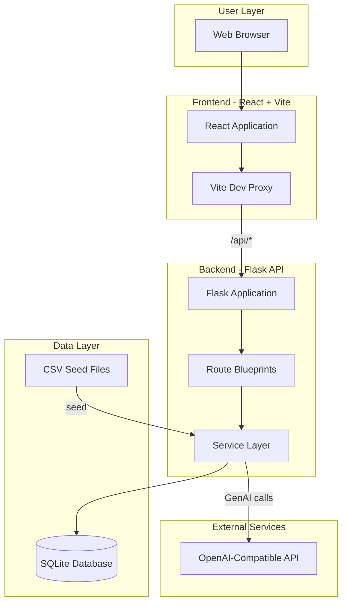
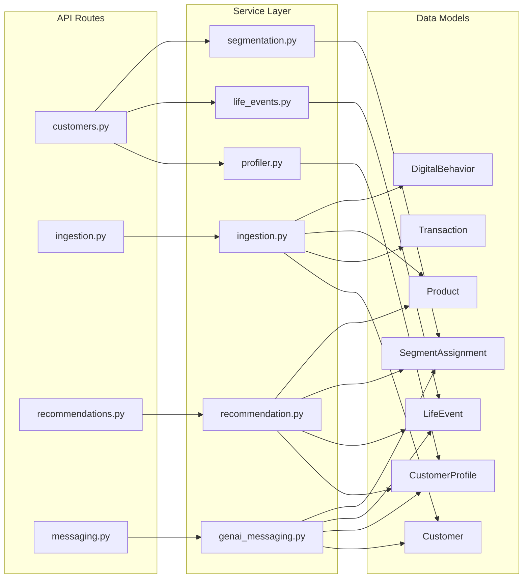
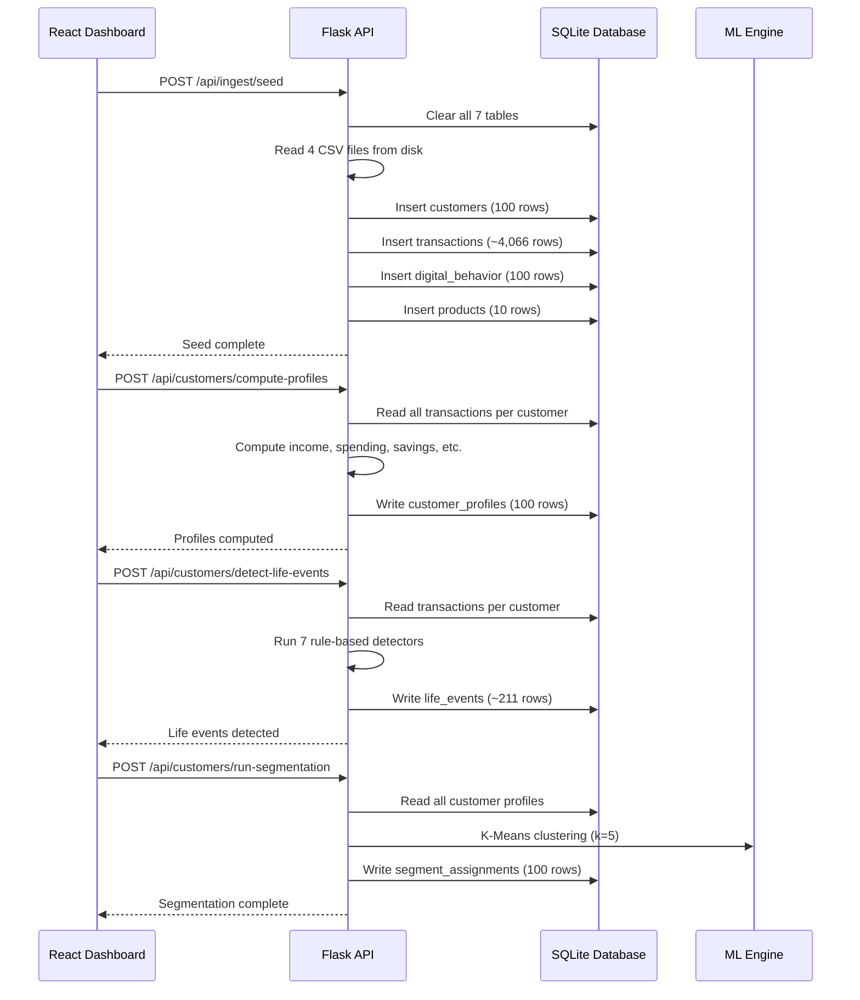
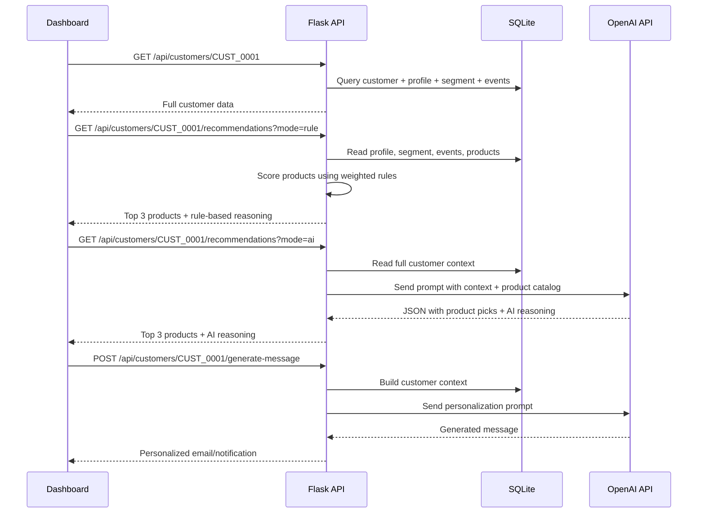
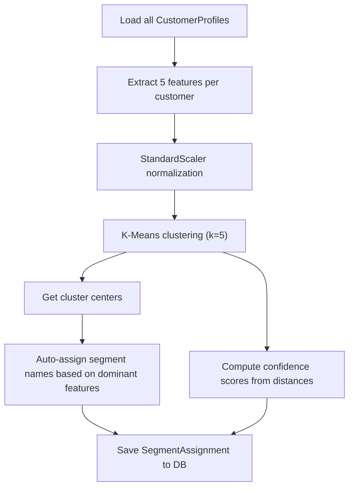
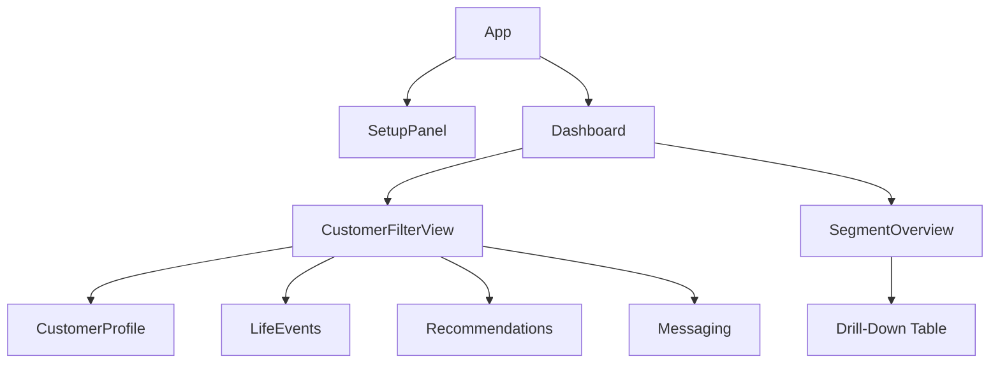

# Technical Design Document

## AI/GenAI Hyper-Personalization Engine for Retail Banking

**Version:** 1.0
**Date:** May 2026

---

## Table of Contents

1. [Executive Summary](#1-executive-summary)
2. [System Architecture](#2-system-architecture)
3. [Data Flow](#3-data-flow)
4. [Database Schema](#4-database-schema)
5. [Backend Design](#5-backend-design)
6. [Frontend Design](#6-frontend-design)
7. [AI/ML Pipeline](#7-aiml-pipeline)
8. [API Reference](#8-api-reference)
9. [File-by-File Code Reference](#9-file-by-file-code-reference)
10. [Technology Stack](#10-technology-stack)

---

## 1. Executive Summary

This system is a full-stack AI-powered hyper-personalization engine for retail banking. It ingests customer transaction data, builds financial profiles, detects life events, segments customers using K-Means clustering, recommends banking products, and generates personalized engagement messages using GenAI.

The system supports two modes for recommendations and life event detection:
- **Rule-Based** — deterministic scoring and pattern matching
- **AI-Powered** — OpenAI-compatible LLM for freeform reasoning

Both modes are toggleable from the dashboard UI.

---

## 2. System Architecture

### High-Level Architecture



### Component Interaction



---

## 3. Data Flow

### Initialization Pipeline

This is the sequence of operations when a user clicks "Initialize System":



### Customer Personalization Journey

This is the flow when a user views a specific customer:



---

## 4. Database Schema

### Entity Relationship Diagram

```mermaid
erDiagram
    Customer ||--o{ Transaction : has
    Customer ||--o| DigitalBehavior : has
    Customer ||--o| CustomerProfile : has
    Customer ||--o{ LifeEvent : has
    Customer ||--o| SegmentAssignment : has

    Customer {
        string customer_id PK
        int age
        string occupation
        string city
        float annual_income
        string marital_status
    }

    Transaction {
        string transaction_id PK
        string customer_id FK
        string transaction_type
        string merchant_category
        float amount
        date transaction_date
    }

    DigitalBehavior {
        string customer_id PK_FK
        int mobile_app_logins
        int credit_card_clicks
        int investment_page_visits
        int chatbot_interactions
    }

    CustomerProfile {
        string customer_id PK_FK
        float monthly_income
        float monthly_spending
        float savings_ratio
        int travel_frequency
        string preferred_spending_category
        string credit_behavior
        float investment_interest
        string risk_appetite
        string preferred_channel
    }

    LifeEvent {
        int id PK
        string customer_id FK
        string event_type
        text description
        datetime detected_at
    }

    SegmentAssignment {
        string customer_id PK_FK
        string segment_name
        int cluster_id
        float confidence
    }

    Product {
        string product_id PK
        string product_name
        string product_type
        float eligibility_income
        text benefits
    }
```

### Table Summary

| Table | Primary Key | Rows (after seed) | Source |
|-------|-------------|-------------------|--------|
| `customers` | `customer_id` | 100 | CSV seed data |
| `transactions` | `transaction_id` | ~4,066 | CSV seed data |
| `digital_behavior` | `customer_id` | 100 | CSV seed data |
| `products` | `product_id` | 10 | CSV seed data |
| `customer_profiles` | `customer_id` | 100 | Computed from transactions |
| `life_events` | `id` (auto) | ~211 | Rule engine on transactions |
| `segment_assignments` | `customer_id` | 100 | K-Means on profiles |

---

## 5. Backend Design

### 5.1 Application Bootstrap

**File:** `backend/app.py` (33 lines)

The Flask application factory pattern. `create_app()` initializes the Flask instance, configures CORS, binds SQLAlchemy, registers 4 route blueprints, and creates all database tables.

```
create_app()
  ├── Load Config (DB URI, OpenAI keys)
  ├── Initialize CORS
  ├── Initialize SQLAlchemy
  ├── Register Blueprints:
  │   ├── customers_bp   → /api/customers/*
  │   ├── ingestion_bp   → /api/ingest/*
  │   ├── recommendations_bp → /api/customers/*/recommendations
  │   └── messaging_bp   → /api/customers/*/generate-message
  └── Create all DB tables
```

**File:** `backend/config.py` (18 lines)

Loads `.env` file via `python-dotenv` and exposes configuration:
- `SQLALCHEMY_DATABASE_URI` — defaults to SQLite file
- `OPENAI_API_KEY`, `OPENAI_BASE_URL`, `OPENAI_MODEL`

**File:** `backend/extensions.py` (4 lines)

Holds the singleton `db = SQLAlchemy()` instance. Imported by models and services to avoid circular imports with `app.py`.

### 5.2 Data Models

**File:** `backend/models/models.py` (154 lines)

Defines 7 SQLAlchemy ORM models. Each model has a `to_dict()` method for JSON serialization. Relationships use `db.relationship()` with `backref` for bidirectional access.

| Model | Table | Relationships |
|-------|-------|---------------|
| `Customer` | `customers` | Has many: Transaction, LifeEvent. Has one: DigitalBehavior, CustomerProfile, SegmentAssignment |
| `Transaction` | `transactions` | Belongs to: Customer |
| `DigitalBehavior` | `digital_behavior` | Belongs to: Customer |
| `Product` | `products` | Standalone |
| `CustomerProfile` | `customer_profiles` | Belongs to: Customer |
| `LifeEvent` | `life_events` | Belongs to: Customer |
| `SegmentAssignment` | `segment_assignments` | Belongs to: Customer |

### 5.3 Service Layer

Each service encapsulates a specific business capability.

#### 5.3.1 Data Ingestion — `backend/services/ingestion.py` (166 lines)

**Purpose:** Loads CSV data into the database with validation.

**Key functions:**
- `validate_csv(df, dataset_type)` — checks required columns exist
- `load_customers(df)` — upserts customer rows (insert or update on duplicate)
- `load_transactions(df)` — inserts new transactions (skip duplicates)
- `load_digital_behavior(df)` — upserts digital behavior data
- `load_products(df)` — upserts product catalog
- `seed_all()` — clears all 7 tables, then loads all 4 CSVs from `seed_data/`
- `upload_csv(file_content, dataset_type)` — loads a single uploaded CSV

**Validation:** Each dataset type has a required column list defined in `REQUIRED_COLUMNS`. Missing columns raise a `ValueError`.

#### 5.3.2 Customer Profile Builder — `backend/services/profiler.py` (129 lines)

**Purpose:** Computes derived financial attributes from raw transactions.

**How `compute_profile(customer_id)` works:**

1. Fetches all transactions for the customer
2. Converts to Pandas DataFrame
3. Computes:
   - `monthly_income` — average of Salary Credit amounts
   - `monthly_spending` — total non-salary debits / number of months
   - `savings_ratio` — (income - spending) / income, floored at 0
   - `travel_frequency` — count of Travel-type transactions
   - `preferred_spending_category` — most frequent merchant category
   - `credit_behavior` — rated Excellent/Good/Fair/No History based on EMI count
   - `investment_interest` — investment transactions per month
   - `risk_appetite` — High/Moderate/Low based on income level
   - `preferred_channel` — Mobile App/Chatbot/Branch based on digital behavior
4. Upserts result into `customer_profiles` table

#### 5.3.3 Life Event Detection — `backend/services/life_events.py` (211 lines)

**Purpose:** Identifies significant customer life events from transaction patterns.

**Architecture:** Uses a decorator-based rule registry pattern:

```python
RULES = []

def rule(event_type):
    def decorator(fn):
        RULES.append((event_type, fn))
        return fn
    return decorator

@rule("Promotion")
def detect_promotion(df):
    # analyze salary trend...
```

**7 Rule-Based Detectors:**

| Rule | Logic | Trigger |
|------|-------|---------|
| `detect_promotion` | Compare first-half vs second-half average salary | Salary growth >20% |
| `detect_frequent_traveler` | Count travel transactions | 5+ travel transactions |
| `detect_new_parent` | Match "Baby" in merchant category | 2+ baby-store purchases |
| `detect_home_buyer` | Average rent payment amount | Avg rent >$2,000 |
| `detect_investor` | Count investment + SIP transactions | 4+ investments or 3+ SIPs |
| `detect_high_spender` | Sum shopping transactions | Shopping total >$10,000 |
| `detect_credit_discipline` | Count EMI payments | 8+ regular EMI payments |

**AI-Powered Detection:** `detect_life_events_ai(customer_id)` sends a transaction summary to OpenAI and asks it to freely identify life events. Returns the same `[{event_type, description}]` format.

#### 5.3.4 Customer Segmentation — `backend/services/segmentation.py` (116 lines)

**Purpose:** Groups customers into 5 segments using K-Means clustering.

**How `run_segmentation()` works:**



**Feature vector:** `[monthly_income, monthly_spending, savings_ratio, travel_frequency, investment_interest]`

**Name assignment logic:** For each feature dimension, the cluster with the highest centroid value for that feature gets the corresponding label:
- Highest `monthly_income` → "Premium Customers"
- Highest `travel_frequency` → "Travelers"
- Highest `savings_ratio` → "Savers"
- Highest `investment_interest` → "Investors"
- Highest `monthly_spending` → "Credit Seekers"

**Confidence score:** `1 - (distance_to_own_center / max_distance)` — customers closer to their cluster center get higher confidence.

#### 5.3.5 Recommendation Engine — `backend/services/recommendation.py` (218 lines)

**Purpose:** Recommends top-3 banking products with reasoning.

**Rule-Based Mode — `get_recommendations()`:**

Scores each of 10 products against the customer using 4 weighted signals:

| Signal | Weight | Example |
|--------|--------|---------|
| Income eligibility | +1.0 | Customer income >= product minimum |
| Life event match | +2.0 | "Frequent Traveler" matches Travel Credit Card |
| Segment match | +1.5 | "Travelers" segment matches product target |
| Profile behavior boost | +1.0 | `travel_frequency > 3` matches card rules |

Products are sorted by total score. Each gets a `reasons[]` list explaining why it was recommended.

**AI-Powered Mode — `get_ai_recommendations()`:**

Sends the full customer context (profile, events, segment) plus the complete product catalog to OpenAI. The LLM freely picks the best 3 products and writes personalized reasoning for each.

#### 5.3.6 GenAI Messaging — `backend/services/genai_messaging.py` (163 lines)

**Purpose:** Generates personalized customer communications.

**How `generate_message()` works:**

1. Checks for `OPENAI_API_KEY` — if missing, uses template fallback
2. Builds rich context string from customer data, profile, segment, events, and recommendations
3. Selects prompt instruction based on message type:
   - `email` — professional marketing email with subject line
   - `push_notification` — max 2 sentences for mobile app
   - `rm_talking_points` — 5 bullet points for relationship manager
   - `chatbot` — conversational product suggestion
4. Calls OpenAI chat completion API
5. On failure, falls back to `_fallback_message()` which uses string templates

**Fallback templates** insert the customer's top recommended product name into pre-written message structures.

### 5.4 Route Layer

| File | Blueprint | Prefix | Endpoints |
|------|-----------|--------|-----------|
| `routes/customers.py` | `customers_bp` | `/api/customers` | 18 endpoints for search, profile, events, segments, filters, export |
| `routes/ingestion.py` | `ingestion_bp` | `/api/ingest` | 2 endpoints for seed and upload |
| `routes/recommendations.py` | `recommendations_bp` | `/api` | 1 endpoint with mode toggle |
| `routes/messaging.py` | `messaging_bp` | `/api` | 1 endpoint for message generation |

### 5.5 Seed Data Generator

**File:** `backend/generate_seed_data.py` (168 lines)

Standalone script using the Faker library to generate realistic banking data:

- **100 customers** with randomized age (22-65), occupation (12 types), city (10 US cities), income ($25K-$200K)
- **~4,066 transactions** — 12 monthly salary credits per customer + 15-40 random spending transactions. 30% of customers have a salary growth pattern (1.2x-1.5x increase at month 7) to trigger the Promotion life event
- **100 digital behavior records** with randomized app usage metrics
- **10 banking products** with predefined names, types, income thresholds, and benefit descriptions

### 5.6 Integration Tests

**File:** `backend/test_integration.py` (195 lines)

Uses Flask's built-in `test_client()` to run 57 end-to-end tests without starting a real server. Tests cover:

1. Data ingestion and row counts
2. Customer search by ID, city, occupation
3. Profile computation and field validation
4. Life event detection counts
5. K-Means segmentation (5 segments, 100 total)
6. Recommendation response format and reasoning_type
7. GenAI messaging for all 4 message types
8. Full customer view with all joined data
9. Segment breakdown by city and occupation
10. Filter, filter-options, and CSV export

---

## 6. Frontend Design

### 6.1 Component Tree



### 6.2 Component Details

#### `App.jsx` (43 lines)
Top-level shell. Manages `initialized` state. Shows the blue gradient header with app title. Renders `SetupPanel` until initialization is complete, then switches to `Dashboard`.

#### `SetupPanel.jsx` (123 lines)
Four-step initialization wizard. Calls these endpoints in sequence:
1. `POST /api/ingest/seed` — Load seed data
2. `POST /api/customers/compute-profiles` — Compute profiles
3. `POST /api/customers/detect-life-events` — Detect life events
4. `POST /api/customers/run-segmentation` — Run segmentation

Each step shows a progress indicator (numbered circle, green check on complete, blue pulse while running). On completion, shows "Open Dashboard" button.

#### `Dashboard.jsx` (35 lines)
Tab navigation between two views:
- **Customer View** → renders `CustomerFilterView`
- **Segment Overview** → renders `SegmentOverview`

#### `CustomerFilterView.jsx` (318 lines)
The main customer exploration interface:

- **Filter panel** with 7 filter inputs:
  - Customer ID (text, partial match)
  - Segment (dropdown from DB distinct values)
  - City (dropdown)
  - Occupation (dropdown)
  - Transaction Date From/To (date pickers)
  - Age Min/Max (number inputs)
- **Go button** sends all active filters to `GET /api/customers/filter`
- **Results list** shows matching customers as expandable rows
- **Expanded row** loads full customer data and renders:
  - `CustomerProfile` + `LifeEvents` side by side
  - `Recommendations` below
  - `Messaging` at the bottom

Dropdowns are populated on mount via `GET /api/customers/filter-options`.

#### `CustomerProfile.jsx` (83 lines)
Read-only card displaying:
- Customer ID, age, occupation, city, income, marital status
- Segment badge (top right)
- Financial profile section: monthly income/spending, savings ratio, travel frequency, preferred category, credit behavior, investment interest, risk appetite, preferred channel

#### `LifeEvents.jsx` (122 lines)
Displays detected life events with Rule-Based / AI-Powered toggle:
- Two toggle buttons in the header
- Badge showing current detection type (green for AI, gray for rule-based)
- Color-coded event cards (green=Promotion, blue=Traveler, pink=New Parent, etc.)
- AI mode events shown in green-tinted cards
- Fetches from `GET /api/customers/<id>/life-events?mode=rule|ai`

#### `Recommendations.jsx` (159 lines)
Top-3 product recommendation cards with Rule-Based / AI-Powered toggle:
- Toggle buttons and badge in header
- Rule-based: shows bullet-point reasons + score + min income
- AI-powered: shows paragraph reasoning, green-tinted cards
- Fetches from `GET /api/customers/<id>/recommendations?mode=rule|ai`

#### `Messaging.jsx` (100 lines)
GenAI message generation panel:
- 4 message type buttons: Email, Push Notification, RM Talking Points, Chatbot
- "Generate Message" button calls `POST /api/customers/<id>/generate-message`
- Shows generated message with model used label
- Copy-to-clipboard button
- Shows fallback note if API key is not configured

#### `SegmentOverview.jsx` (319 lines)
K-Means segment visualization and drill-down:
- **Segment cards** showing count and percentage per segment, clickable
- **Sub-filter bar** (appears on card click): City, Occupation, Age Min/Max dropdowns + Apply button
- **Drill-down table**: customer list for selected segment (filtered by sub-filters)
- **Export to CSV** button downloads filtered data
- **Charts**: Recharts BarChart (distribution) and PieChart (share) side by side

### 6.3 API Client

**File:** `frontend/src/api/client.js` (52 lines)

Axios instance with `baseURL: "/api"`. Vite proxies all `/api/*` requests to the Flask backend at `127.0.0.1:5001`.

Exports thin wrapper functions for every backend endpoint. Key functions accept optional parameters (e.g., `getRecommendations(id, mode)`, `getLifeEvents(id, mode)`, `getFilteredCustomers(filters)`).

### 6.4 Styling

- **Tailwind CSS** with custom `bank` color palette (blues from `#eff6ff` to `#1e3a8a`)
- **Recharts** for segment bar and pie charts
- Card-based layout with rounded corners, subtle shadows, and hover effects

---

## 7. AI/ML Pipeline

### 7.1 Machine Learning (Scikit-learn)

**K-Means Segmentation:**
- Algorithm: `sklearn.cluster.KMeans`
- Features: 5 numerical profile attributes
- Preprocessing: `StandardScaler` (zero mean, unit variance)
- Hyperparameters: `n_clusters=5`, `n_init=10`, `random_state=42`
- Output: Cluster labels (0-4) mapped to business names, plus confidence scores

### 7.2 Rule Engine

**Life Events:** 7 Python functions decorated with `@rule()`, each analyzing a Pandas DataFrame of transactions and returning a description string or `None`.

**Recommendations:** `PRODUCT_RULES` dictionary mapping each product ID to eligibility criteria (life events, segments, income threshold, profile lambda). Weighted scoring produces a ranked list.

### 7.3 GenAI (OpenAI-Compatible)

**Provider:** Any OpenAI-compatible API (OpenAI, Azure OpenAI, custom endpoints).

**Configuration:** `OPENAI_API_KEY`, `OPENAI_BASE_URL`, `OPENAI_MODEL` via `.env`.

**Usage points:**
1. **AI Recommendations** — Prompt includes full customer context + 10-product catalog. Expects JSON array response with product_id and reasoning.
2. **AI Life Events** — Prompt includes transaction summary. Expects JSON array with event_type and description.
3. **GenAI Messaging** — Prompt includes customer context + message type instruction. Returns freeform text.

**Fallback:** Every AI feature has a non-AI fallback (rule-based scoring, template messaging) that activates when no API key is set or when the API call fails.

---

## 8. API Reference

### Data Ingestion

| Method | Path | Request | Response |
|--------|------|---------|----------|
| POST | `/api/ingest/seed` | — | `{message, results: {customers, transactions, ...}}` |
| POST | `/api/ingest/upload` | `file` (multipart), `dataset_type` (form) | `{message, count}` |

### Customer Endpoints

| Method | Path | Params | Response |
|--------|------|--------|----------|
| GET | `/api/customers/` | `q`, `page`, `per_page` | `{customers[], total, page}` |
| GET | `/api/customers/<id>` | — | `{customer, profile, segment, life_events[]}` |
| GET | `/api/customers/<id>/profile` | — | Profile object |
| GET | `/api/customers/<id>/life-events` | `mode` (rule/ai) | `{events[], detection_type}` |
| GET | `/api/customers/<id>/segment` | — | Segment object |
| GET | `/api/customers/<id>/recommendations` | `mode` (rule/ai) | `{recommendations[], reasoning_type}` |
| POST | `/api/customers/<id>/generate-message` | `message_type` (body) | `{generated_message, model_used}` |

### Pipeline Endpoints

| Method | Path | Response |
|--------|------|----------|
| POST | `/api/customers/compute-profiles` | `{message, count}` |
| POST | `/api/customers/detect-life-events` | `{message, customers_with_events, total_events}` |
| POST | `/api/customers/run-segmentation` | `{message, count}` |

### Segment & Filter Endpoints

| Method | Path | Params | Response |
|--------|------|--------|----------|
| GET | `/api/customers/segments/overview` | — | `[{segment_name, customer_count}]` |
| GET | `/api/customers/segments/by-city` | — | `[{segment_name, customer_count}]` |
| GET | `/api/customers/segments/by-occupation` | — | `[{segment_name, customer_count}]` |
| GET | `/api/customers/filter-options` | — | `{cities[], occupations[], segments[]}` |
| GET | `/api/customers/filter` | `customer_id, segment, city, occupation, age_min, age_max, date_from, date_to` | `{customers[], total}` |
| GET | `/api/customers/export` | Same as filter | CSV file download |

---

## 9. File-by-File Code Reference

### Backend Files

| File | Lines | Purpose |
|------|-------|---------|
| `backend/app.py` | 33 | Flask application factory; registers blueprints and creates DB tables |
| `backend/config.py` | 18 | Loads `.env` and defines Config class (DB URI, OpenAI settings) |
| `backend/extensions.py` | 4 | Shared SQLAlchemy instance to avoid circular imports |
| `backend/models/models.py` | 154 | 7 SQLAlchemy ORM models with `to_dict()` serialization |
| `backend/services/ingestion.py` | 166 | CSV validation, 4 dataset loaders, seed and upload functions |
| `backend/services/profiler.py` | 129 | Computes 9 profile attributes from transaction aggregation |
| `backend/services/life_events.py` | 211 | 7 rule-based detectors + AI-powered detection via OpenAI |
| `backend/services/segmentation.py` | 116 | K-Means clustering, auto segment naming, confidence scoring |
| `backend/services/recommendation.py` | 218 | Weighted rule scoring + OpenAI freeform recommendations |
| `backend/services/genai_messaging.py` | 163 | OpenAI message generation with template fallback |
| `backend/routes/customers.py` | 230 | 18 endpoints: search, profile, events, segments, filters, export |
| `backend/routes/ingestion.py` | 39 | Seed and upload endpoints |
| `backend/routes/recommendations.py` | 35 | Recommendation endpoint with rule/AI mode toggle |
| `backend/routes/messaging.py` | 21 | Message generation endpoint |
| `backend/generate_seed_data.py` | 168 | Faker-based synthetic data generator for 4 CSV datasets |
| `backend/test_integration.py` | 195 | 57 end-to-end tests using Flask test client |

### Frontend Files

| File | Lines | Purpose |
|------|-------|---------|
| `frontend/src/main.jsx` | 11 | React 18 entry point, mounts App into DOM |
| `frontend/src/App.jsx` | 43 | App shell with header; toggles between setup wizard and dashboard |
| `frontend/src/api/client.js` | 52 | Axios API client with wrapper functions for all endpoints |
| `frontend/src/components/SetupPanel.jsx` | 123 | 4-step initialization wizard with progress indicators |
| `frontend/src/components/Dashboard.jsx` | 35 | Tab navigation: Customer View / Segment Overview |
| `frontend/src/components/CustomerFilterView.jsx` | 318 | Multi-filter panel with expandable customer rows |
| `frontend/src/components/CustomerProfile.jsx` | 83 | Customer info and financial profile card |
| `frontend/src/components/CustomerSearch.jsx` | 98 | Debounced search dropdown (legacy, available for reuse) |
| `frontend/src/components/LifeEvents.jsx` | 122 | Life event cards with rule/AI toggle |
| `frontend/src/components/Recommendations.jsx` | 159 | Product recommendation cards with rule/AI toggle |
| `frontend/src/components/Messaging.jsx` | 100 | GenAI message generation with 4 types and copy-to-clipboard |
| `frontend/src/components/SegmentOverview.jsx` | 319 | Segment cards, charts, drill-down table, sub-filters, CSV export |

### Configuration Files

| File | Purpose |
|------|---------|
| `backend/requirements.txt` | Python dependencies (Flask, Pandas, Scikit-learn, OpenAI, etc.) |
| `backend/.env.example` | Environment variable template |
| `frontend/package.json` | Node.js dependencies (React, Vite, Tailwind, Recharts, Axios) |
| `frontend/vite.config.js` | Vite dev server on port 3000 with API proxy to Flask 5001 |
| `frontend/tailwind.config.js` | Tailwind CSS content paths and custom bank color palette |
| `frontend/postcss.config.js` | PostCSS plugins (Tailwind, Autoprefixer) |

---

## 10. Technology Stack

| Layer | Technology | Version | Purpose |
|-------|-----------|---------|---------|
| **Frontend** | React | 18.x | UI component framework |
| | Vite | 5.x | Build tool and dev server |
| | Tailwind CSS | 3.x | Utility-first CSS styling |
| | Recharts | 2.x | Charts (bar, pie) |
| | Axios | 1.x | HTTP client for API calls |
| **Backend** | Python | 3.10+ | Server-side runtime |
| | Flask | 3.x | REST API framework |
| | SQLAlchemy | 2.x | ORM for database access |
| | Flask-CORS | 6.x | Cross-origin request handling |
| | Flask-SQLAlchemy | 3.x | Flask-SQLAlchemy integration |
| **Database** | SQLite | Built-in | Default file-based database |
| | PostgreSQL | (optional) | Production-grade alternative |
| **AI/ML** | Scikit-learn | 1.x | K-Means clustering |
| | Pandas | 2.x | Data manipulation and aggregation |
| | NumPy | 2.x | Numerical computing |
| **GenAI** | OpenAI SDK | 2.x | Chat completion API client |
| **Data Gen** | Faker | 40.x | Synthetic data generation |
| **Testing** | Flask test_client | Built-in | Integration testing |
